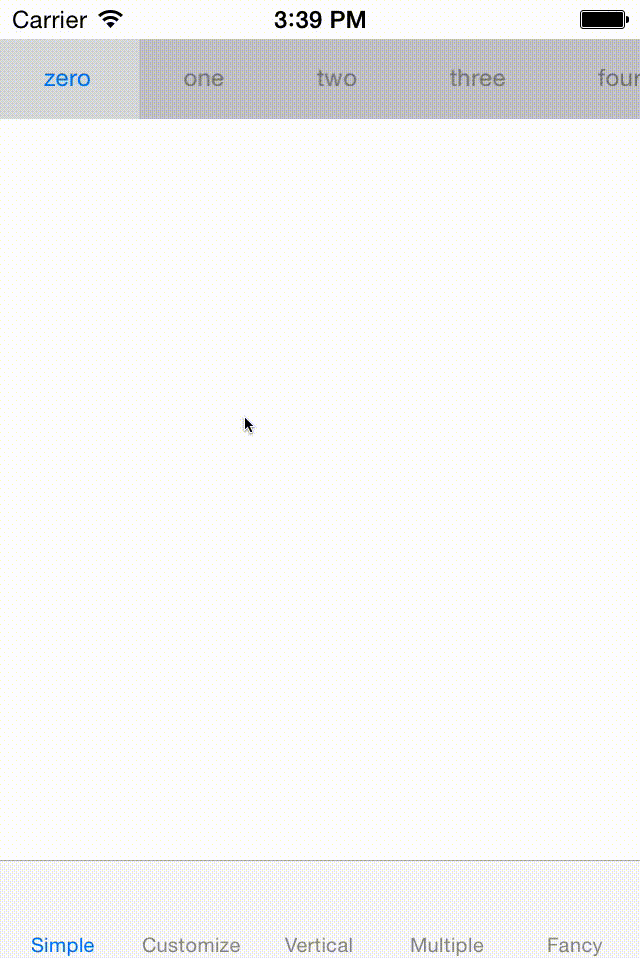

# ScrollTab

A scroll tab alternative to `UISegmentedControl`.



# Install

## [CocoaPods](https://cocoapods.org/)

``` ruby
pod 'ScrollTab'
```

## Manual

Add the files in the `ScrollTab` folder to your project.

# Usage

```  objc
#import "ScrollTab.h"

  // ...

  ScrollTab *tab = [[ScrollTab alloc] init];

  ScrollTabConfig *config = [[ScrollTabConfig alloc] init];
  config.items = @[@"zero", @"one", @"two", @"three", @"four"];

  tab.selected = ^(NSString *noop, NSInteger index) {
      NSLog(@"selected tab with index %@", @(index));
  };
  tab.config = config;

  // Layout
  [self.view addSubview:tab];
  // ...
```

## Customize

Change the control's layout, item font/colors and more using `ScrollTabConfig`.

# Demo

`ScrollTab` includes a sample project.

# Compatibility

This project was tested with iOS 10, see the [`1.x` tags](releases) for older versions.

# Contact

- [github.com/dkhamsing](https://github.com/dkhamsing)
- [twitter.com/dkhamsing](https://twitter.com/dkhamsing)

# License

`ScrollTab` is available under the MIT license. See the [LICENSE](LICENSE) file for more info.
